## Deep Double Q-learning
### Author: Naeem Khoshnevis

<figure class="image">
<!-- 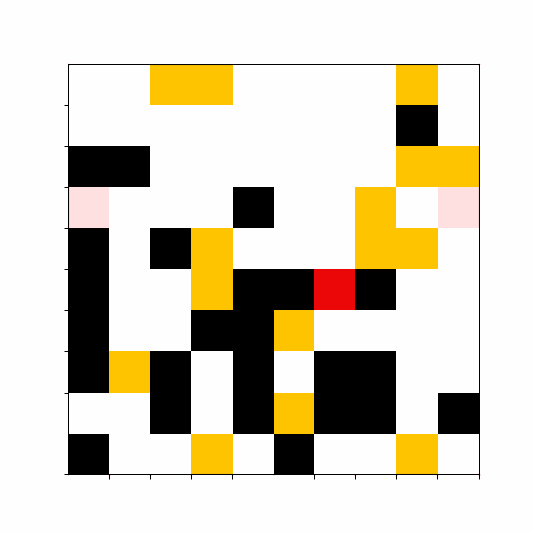 -->

</figure>

In this project, Deep Q-learning and Double Deep Q-learning algorithms are implemented to collect gold nuggets and deliver them to predefined storage. The domain is a 2-dimensional maze. The following figure shows an example of the domain and its features.

<figure class="image">
  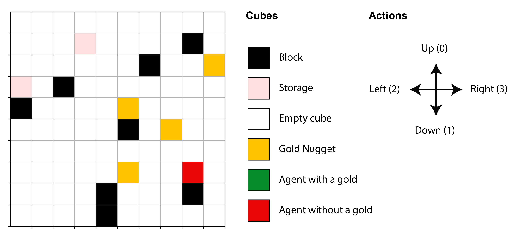
  <figcaption>Example of the project environment. Cube’s color definition is represented on the right. The agent (red cube) is allowed to normal moves. The color of the agent turns green (not shown in the domain) upon collecting a gold. See the text for more details.</figcaption>
</figure>

The agent learns the optimal policy by the DDQL algorithm. The following table shows the immediate rewards for the agent actions. 

|                             Action                                |  Reward | 
| ----------------------------------------------------------------- | ------- |
| Hitting the borders                                               |   -1.00 |
| Hitting the blocks(walls)                                         |   -1.00 |
| Wandering around                                                  |   -0.05 |
| Entering a cube with gold while the agent has gold                |   -0.05 |
| Entering a cube with gold while the agent does not have the gold  |   +1.00 |
| Entering storage while the agent has gold                         |   +1.00 |
| Entering storage while the agent does not have gold               |   -0.20 |

For more details about the domain, please refer to the following files:
- [Domain API](domain.py)
- [Domain Interaction](domain_prep.ipynb)

*GameConroller* class manages the training process. The following figure shows the UML diagram of the implementation. 

<figure class="image">
  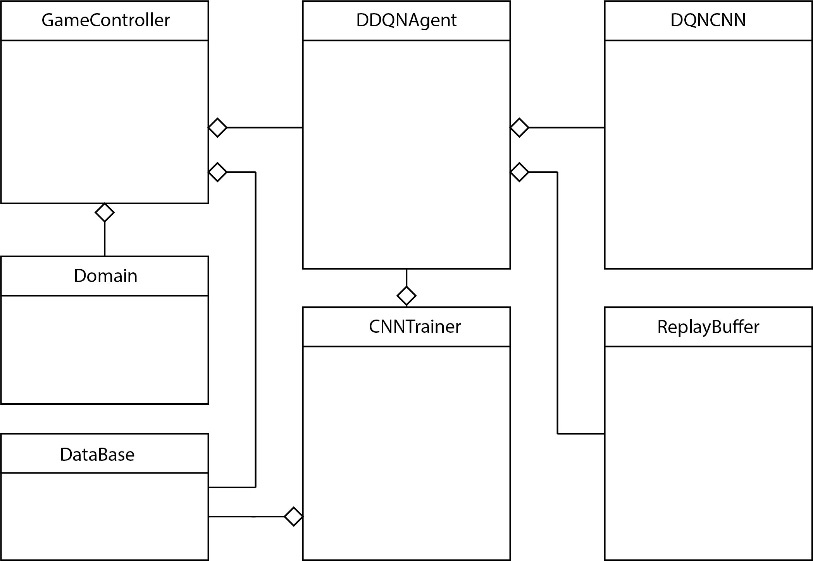
  <figcaption>UML diagram of the project implementation. The hollow diamonds represent an aggregation ("has-a") relationship; for example, GameController has-a DDQNAgent.
  </figcaption>
</figure>

Use the following *Notebook* for quick start.
- [Train An Agent](train_an_agent.ipynb)

Set `new_agent_loc: True` to start from different initial locations.

  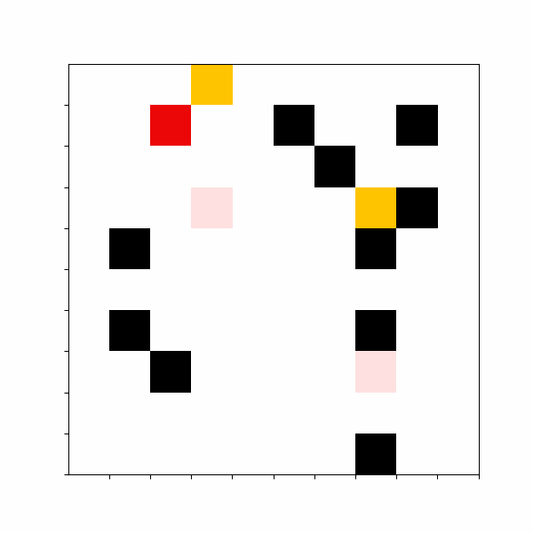
  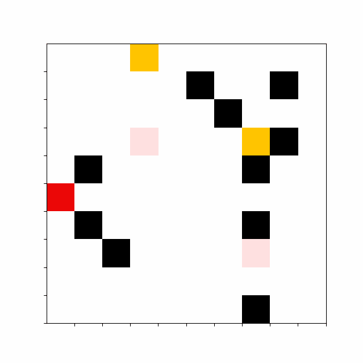
  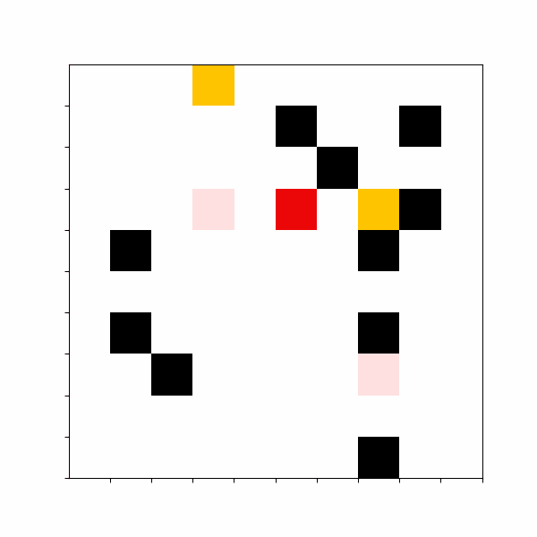
  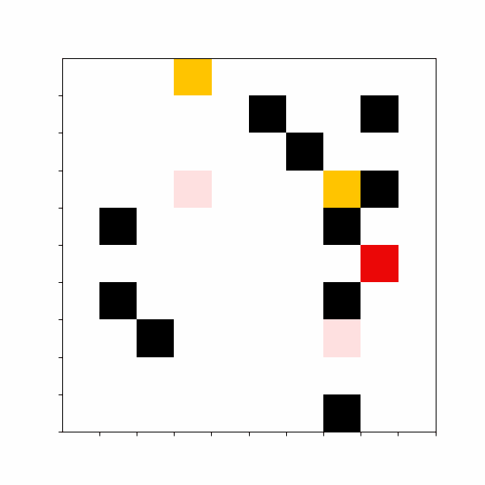

  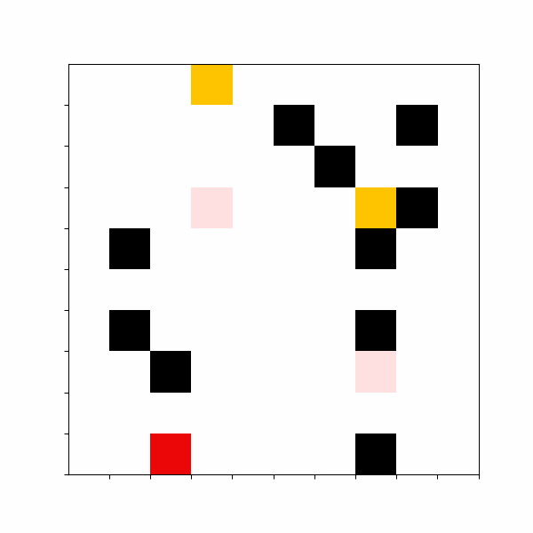
  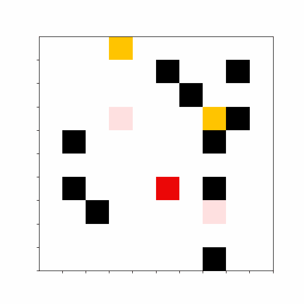
  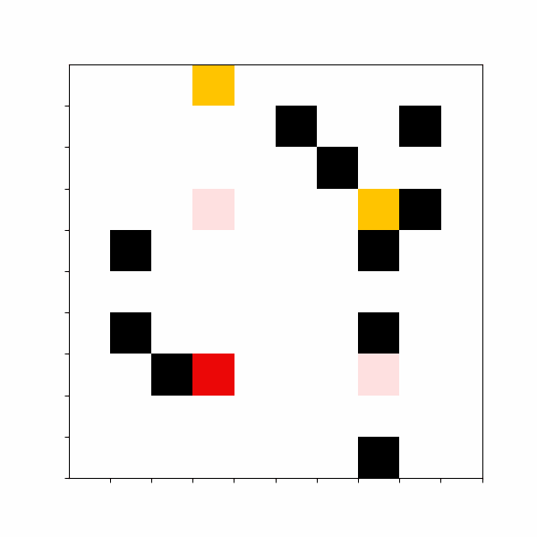
  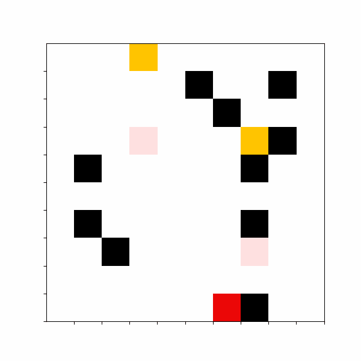

